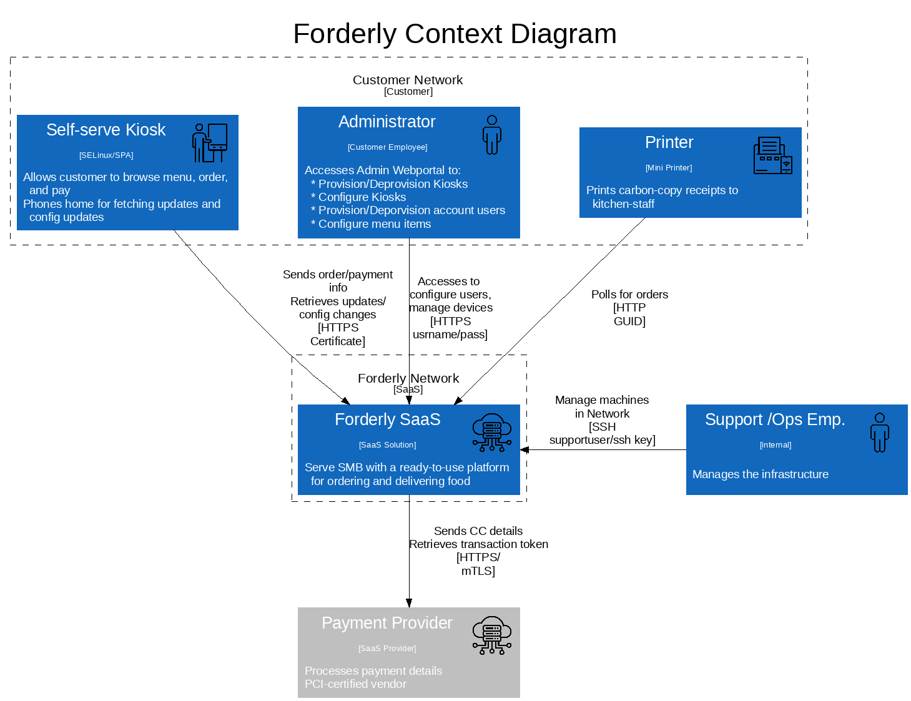

# Target of Evaluation

Forderly Online Food Ordering System (multi-tenant SaaS)

Caters to small businesses, by offering a complete solution for food ordering.
Custom-built hardware platforms allow any restaurant to streamline their food ordering and delivery processes to enhance your customer’s in-restaurant experience.

## Context Diagram

## Container Diagram

## Vulnerabilities

|Id| Title| Vulnerability | Attack scenario | Outcome|Severity|
|--|--|--|--|--|--|
|1| PKI defective | The lifecycle of the certificates is not clearly defined| GIVEN we don't have a well-defined PKI with a CRL serving point AND we have no HSM/TPM storing the certificate keys, WHEN a certificate is extracted from a kiosk, THEN an adversary can impersonate a kiosk and create orders for a customer| * Grant access to unauthorized parties * creating too many non-existing orders for a customer| Medium
|2| PKI defective | The lifecycle of the certificates is not clearly defined| GIVEN we don't have a well-defined PKI with a CRL serving point AND we have no HSM/TPM storing the certificate keys, WHEN a certificate is extracted from a kiosk, THEN an adversary can impersonate a kiosk and create orders for a customer| * Grant access to unauthorized parties * creating too many non-existing orders for a customer| Medium
|3| impersonation of kiosk | The usage of a self-signed certificate with no clear cert authority| GIVEN we don't have a well-defined PKI with a CRL serving point WHEN an adverary creates a self-signed certificate  THEN we grant access to our admin and order APIs| * Grant access to unauthorized parties * creating too many non-existing orders for a customer| Medium
|4| Printer communications tampering | Unencrypted communication: Printers use unencrypted communications to retrieve orders| GIVEN the communication between printer and SaaS is not encrypted WHEN a bad actor along the communication path places itself between endpoint and server THEN the messages can be altered or replayed AND the GUID can be leaked.|* Non-existing orders can be printed. * Orders never get printed * Non expected outputs are printed| Medium
|5|Insufficient AuthN/Z method for printer | A GUID as parameter is not enough to be certain about the identity of an entity| GIVEN the API endpoint is open and expecting connections WHEN a malicious actor connects without authentication and presents GUIDs THEN the API Endpoint can be overloaded OR a correct GUID can be guessed |* DoS of printer API Endpoint * Queues are emptied before the legitimate printer can query, thus never producing the food| Medium
|6| Insufficient ops access identifiability | Shared SSH keys are used to connect to the infrastructure. | GIVEN SSH keys are shared between employees, WHEN a problem arises in the infrastructure, THEN it is impossible to say who is responsible|* Outages, misconfigurations, problems with the infrastructure that affect all clients * Data leakage of all clients * Shared key leaked by disgruntled employee| High
|7|Insufficient ops access security|Cannot either revocate keys for employees leaving the company or after compromise or expire keys after a certain time|GIVEN ssh keys are managed individually on the jump host WHEN a key is potentially compromised OR an employee is leaving the company, THEN it is impossible to couple HR or incident response processes to access to the infrastructure|* Disgruntled employee keeps access to the infrastructure * Compromised employee laptop leads to compromise of the infrastructure| High
|8|PCI data is potentially stored in DB| As part of the order process the CC data is possibly stored in the DB| GIVEN that all orders are stored in the DB AND the Credit Card data is part of the order WHEN anyone with access to the DB queries it THEN the CC data is available|* PCI-Incompliant implementation. * CC Data can be leaked across all customers|Critical
