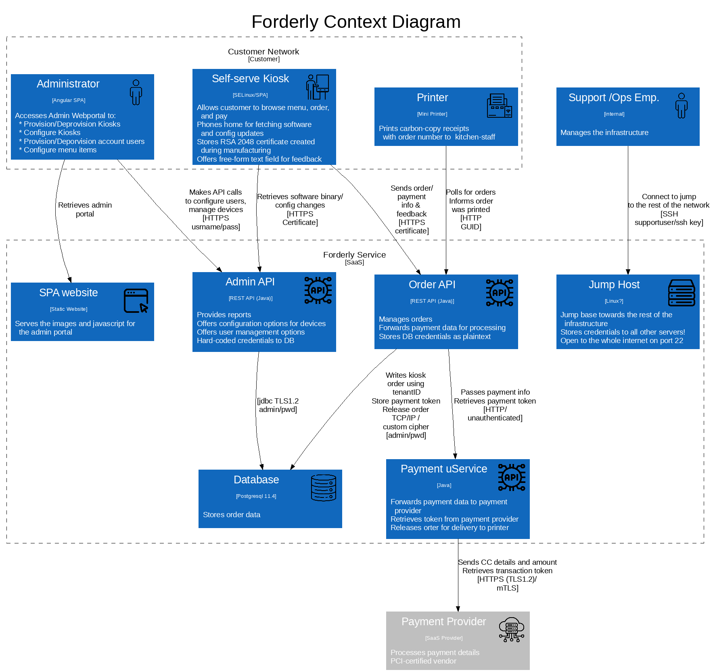

# Target of Evaluation

Forderly Online Food Ordering System (multi-tenant SaaS)

Caters to small businesses, by offering a complete solution for food ordering.
Custom-built hardware platforms allow any restaurant to streamline their food ordering and delivery processes to enhance your customer’s in-restaurant experience.

## Context Diagram

## Container Diagram

## Vulnerabilities

|Id| Title| Vulnerability | Attack scenario | Outcome|Severity|
|--|--|--|--|--|--|
