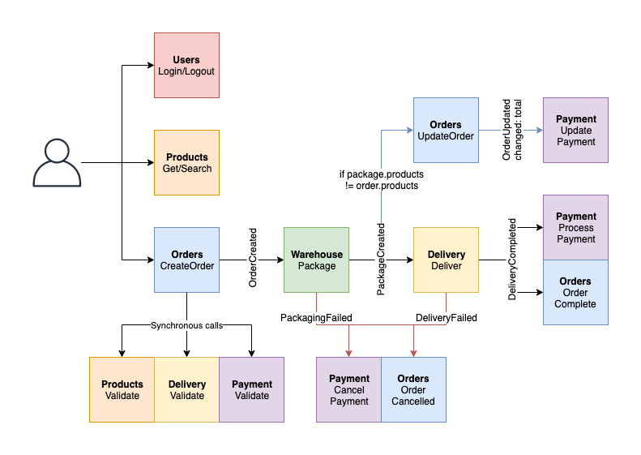
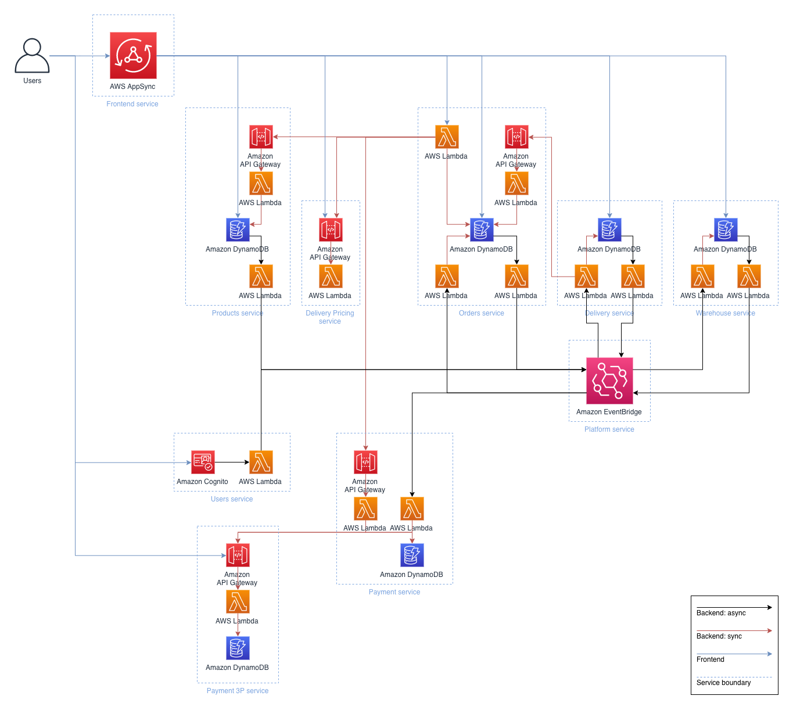
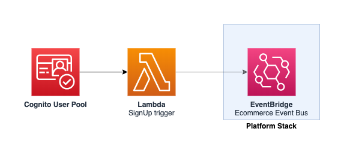
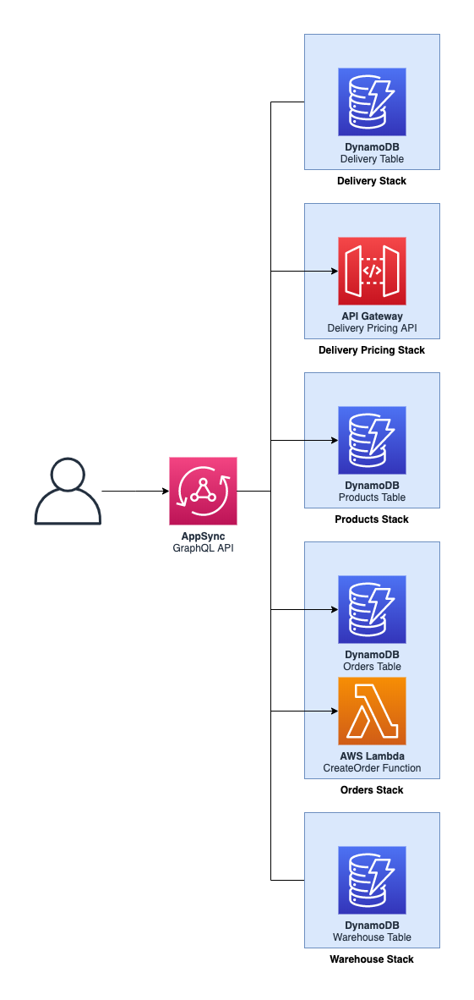
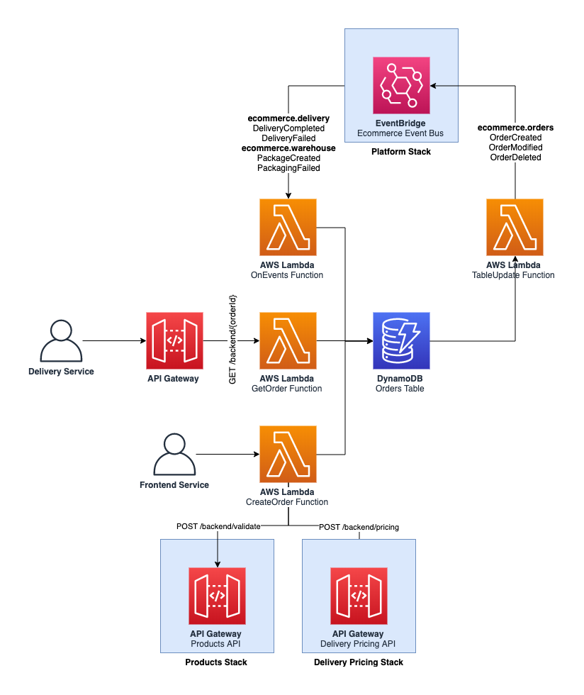
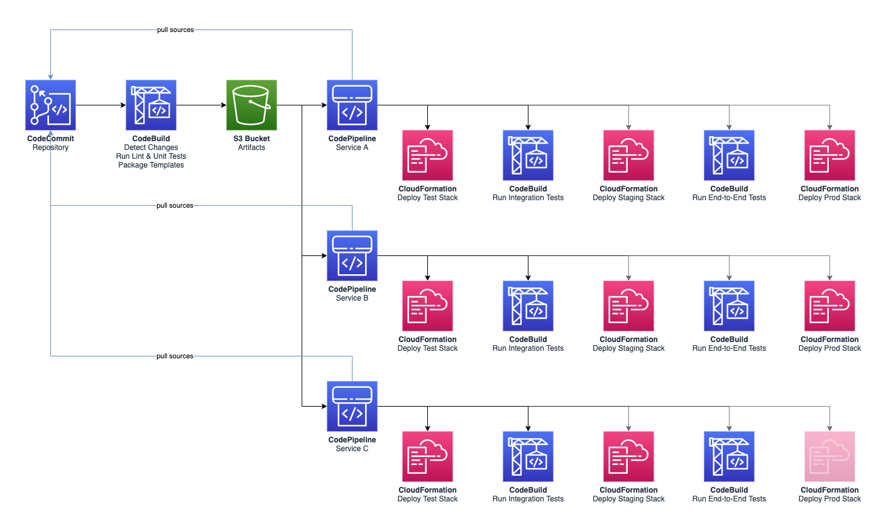

# Threat Model of E-Commerce platform

## Target of evaluation

Implementation of a serverless backend for an e-commerce website. Functionalities are split across multiple micro-services that communicate either through asynchronous messages over Amazon EventBridge or over synchronous APIs.

### Data Flows

## Business Impact Assessment

Critical to the survival of the organization. No brick and mortar stores exist for the company.

### Data Assets

1. Users
    * name
    * email
    * address
    * payment data
    * password
    * phone number

2. Operations
    * Inventory data - products, number, prices
    * delivery prices
    * orders
    * warehouse - packaging of orders
    * delivery - status of delivery
    * Payment processing data

## Information Classification

Confidentiality: High
Integrity : High (inventory, prices, customer data)
Availability: 99.5
                RTO 30 minutes
                RPO 5 minutes

## Architecture

### High-level architecture

### User

### Frontend API

### Orders API

Single source of truth for data related to an order: delivery address, products, user, etc.

As orders are (somewhat) immutables, information about the delivery address and products are replicated within the order to ensure consistency over time. In some cases (e.g. if a product cannot be packaged, is substituted to another item, etc.), the order might be modified. This service also monitors the change in state from other services (mainly delivery and warehouse) so that users can probe the status of their order.

When a user creates an order, this service also acts as a central gate that contacts other services to verify that the user input is valid. For example, this checks that the products exist and that the prices are correct. If any check fails, this will return an error to the end-user.

### Platform Pipeline

Commit pushed to the main branch of the CodeCommit repository  triggers a CodeBuild project that will detect which services have changed since the last project execution, run lint and unit tests and send artifacts to an S3 bucket.

Each service has its own pipeline powered by CodePipeline. When a new version of the artifacts for that service is uploaded to S3, this will trigger the pipeline.

The pipeline will first fetch the sources from CodeCommit, deploy the stack to a testing environment and run integration tests against that stack.

## Findings

ID|vulnerability| threat scenario| countermeasure|
--|--|--|--|
1|insufficient isolation between logical components of the system| An attacker tricks the lambda into executing a call to another lambda it wouldn't normally interact with| Isolate within VPCs or at least security groups all lambdas|
2| lambdas allow code execution| an attacker could trick the code in a lambda to execute code prepared by the attacker | do SAST to identify dangerous OS-level, child processes calls and flag them for fixing in the vulnerability management program|
3| insufficiently specified password recovery mechanism| An attacker tries to trigger a password reset and is able to set a new password| |
4|Compromised Email or Mobile Account|An attacker gains access to a user's email or mobile account used for password recovery.| 1. Implement multi-factor authentication (MFA) for all users. 2. Use one-time codes or links sent to a user's registered mobile phone or email for password resets. 3. Notify users of password reset requests and completions via their secondary email or phone number. 4. Monitor for unusual activities like multiple password reset attempts. 5. Educate users on securing their email/mobile accounts and recognizing phishing. 6. Conduct regular security audits.|
5|Phishing Attacks|An attacker sends a phishing email to trick users into resetting their passwords.|1 . Implement MFA to add an additional layer of security. 2. Educate users to identify . 3. Establish a clear protocol for password resets, including manual verification for high-privilege accounts. 4. Monitor for and respond to reported phishing incidents promptly.|
6|Exposed Credentials in Execution Environment|An attacker, having identified a vulnerability in the function (such as an SQL injection), exploits it to gain access to the function’s environment. They then extract the database credentials from the environment variables, gaining unauthorized access to sensitive user data.|1. Implement Least Privilege Access: Restrict Lambda functions' permissions to the minimum necessary. 2. Use AWS Secrets Manager or Parameter Store: Store sensitive data securely. 3. AWS Lambda Environment Variable Encryption: Encrypt environment variables using AWS KMS. 4. Application Identity for Each Lambda: Assign unique IAM identities. 5. Set Access Control Lists (ACLs) for Lambdas: Define ACLs to restrict resource interactions. 6. Rotate Credentials Regularly: Automate the rotation of stored secrets. 7. Regular Audits and Logging: Monitor activities using AWS CloudTrail and CloudWatch. 8. Encryption at Rest and in Transit: Ensure data is encrypted when stored and transferred. 9. Code Reviews and Static Analysis: Identify hard-coded credentials or improper data handling. 10. Education and Training: Teach best practices for handling credentials and secure coding.|
