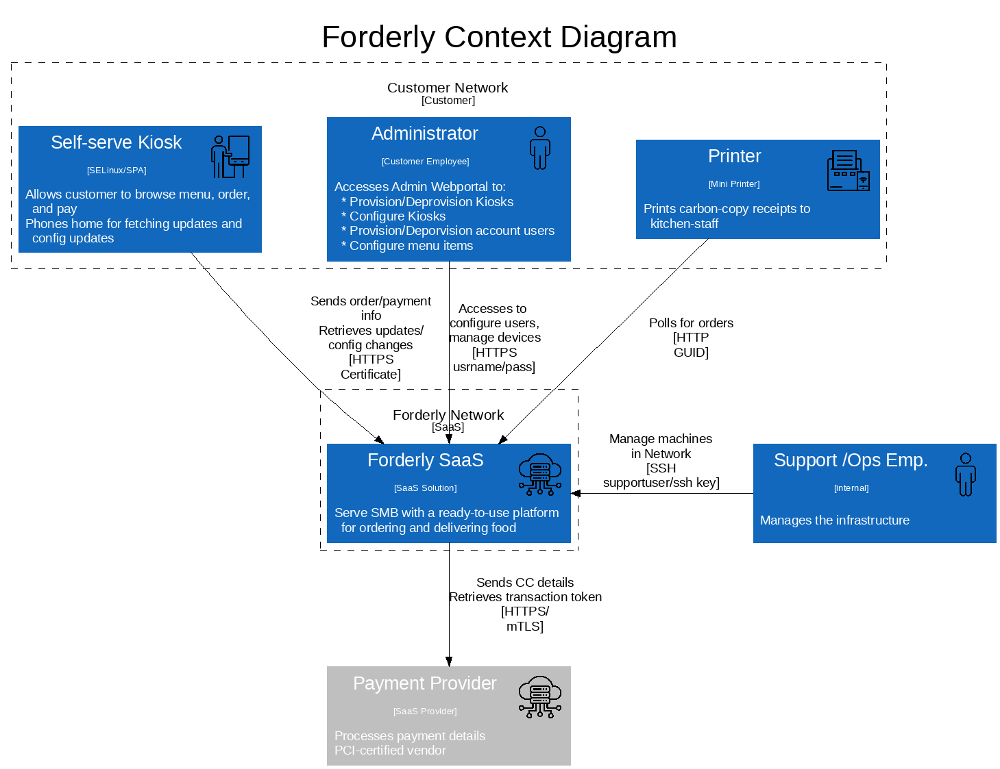
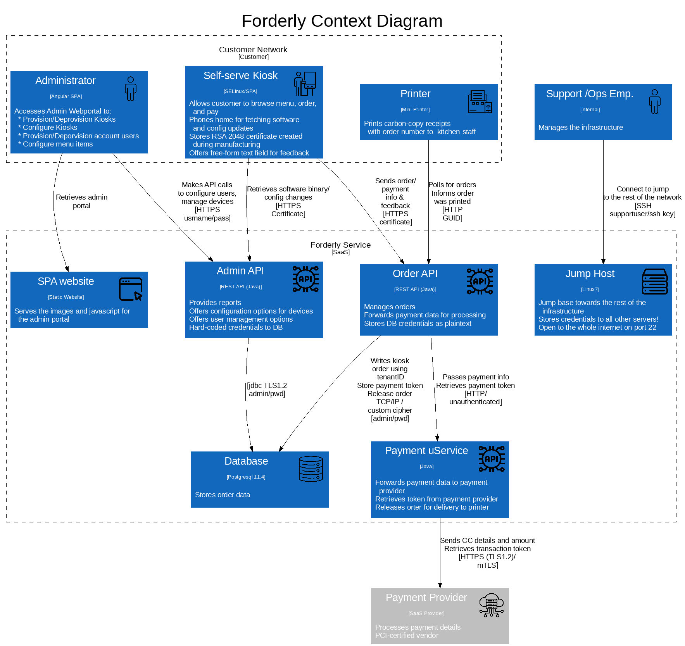

# Target of Evaluation

Going-going-gone - Hybrid auctions model

## High-level requirements 

* An auction company wants to take their auctions online to a nationwide scale
* Customers choose the auction to participate in, wait until the auction begins, then bid as if they were there in the room, with the auctioneer

## Detailed requirements

* auctions must be categorized and \"discoverable\"; 
* aauctions must be real-time; 
* auctions must be mixed live and online; 
* avideo stream of the action; 
* amoney exchange; 
* aparticipants must be tracked (reputation); 
* ascale up to hundreds of participants (per auction), potentially up to thousands of participants, and as many simultaneous auctions as possible

## Context Diagram

## Container Diagram

## Vulnerabilities

|Id| Title| Vulnerability | Attack scenario | Outcome|Severity|
|--|--|--|--|--|--|

