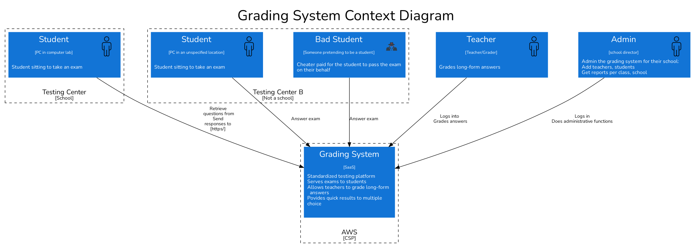

# Target of Evaluation

Grading System SaaS is a solution to support standardized testing across all public school systems grades 3-12. It serves over 40,000+ students, 2000 graders, and 50 administrators.

It is hosted in AWS.

## Requirements

* Students will only be able to use the application within testing centers around the state, most of these will be in the schools, but not all of them
* Students should be able to take a test, and the results eventually consolidated to a single location representing all of the test scores across the state (by school, teacher, and student).
* Tests will be multiple choice, short answer, and essay."
* The system should have a reporting system to know which students have taken the tests and what score they received.
* Short answer and essay questions will be manually graded by teachers, who will then add the essay grades to the system.

### Further context

* A change approval processes involving three different government agencies is required for changes to the way student grades are kept to ensure security
* The state does not own its hosting center, but outsources it to a third party
* Project must defend its budget each fiscal year.

## Diagrams

### Context Diagram

This is the grading system in its context of use, with its different stakeholders

### Container Diagram

|Id| Title| Vulnerability | Attack scenario | Outcome|Severity|
|--|--|--|--|--|--|

